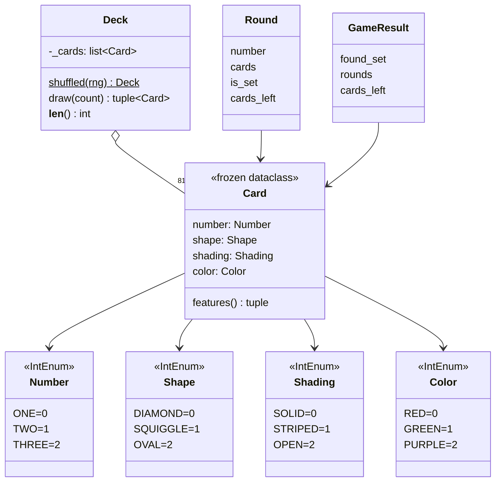
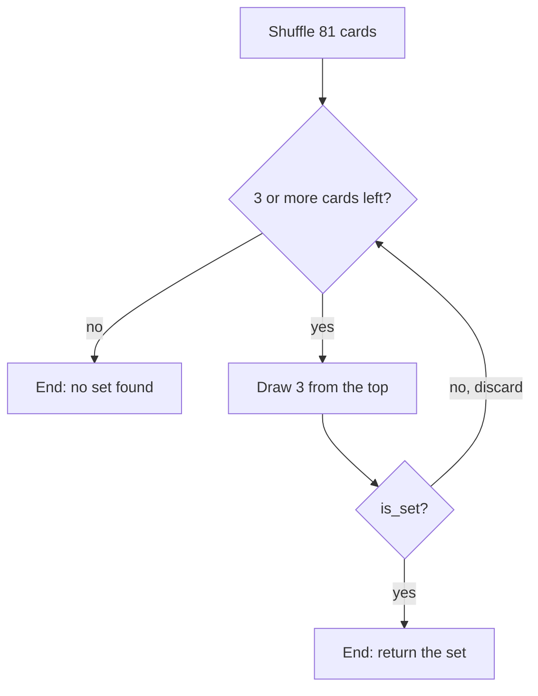

# Set game: design

This explains how the program in `set_game/` is built and why. The interview answer, with alternatives and the probability analysis, is in [`../q4.md`](../q4.md).

## 1. Requirements → code → tests

Every instruction in the question, where it's implemented, and the test that proves it.

| Instruction | Implemented in | Proven by (`tests/`) |
|---|---|---|
| Four features, three values each (number, shape, shading, color) | `features.py`: `Number`, `Shape`, `Shading`, `Color`, `FEATURES` | `test_requirements.py::test_four_features_with_three_values_each` |
| 81 unique cards; every combination exactly once | `deck.py::all_cards` (`itertools.product` over the 4 features) | `test_every_combination_appears_exactly_once`, `test_deck.py::test_example_card_from_the_question_appears_once` |
| Rules: per feature, all the same or all different | `rules.py::is_set` | `test_every_decision_matches_the_rules` (checked against a separate mod-3 rule on 300 games), `test_each_feature_alone_can_break_a_set` (×4), `test_rules.py::test_full_deck_contains_exactly_1080_sets` |
| Draw three unique cards | `deck.py::Deck.draw` (no replacement), `game.py::play` | `test_each_round_draws_three_unique_cards_never_seen_before` |
| Decide whether they form a set | `game.py::play` calls `is_set` each round | `test_every_decision_matches_the_rules` |
| Repeat until a set is found… | `game.py::play`: `if current.is_set: return` | `test_game_stops_right_after_the_first_set` |
| …or the deck is empty | `game.py::play`: `while len(deck) >= 3` | `test_without_a_set_the_whole_deck_is_used`, `test_game.py::test_stops_when_fewer_than_three_cards_remain` |
| Clear design for each element (Card, Deck, Feature…) and the matching algorithm | One module per element; see §2 | `test_deck.py`, `test_rules.py`, `test_game.py` test each element on its own |
| Mind time and space complexity | See §5 | `test_game_result_does_not_store_the_drawn_cards`; at most 27 rounds checked over 300 games |

**One interpretation choice.** "Repeat until a set is found" is read literally: draw 3, check, discard, draw the next 3. The other reading (keep every drawn card and look for a set among all of them) is described in `q4.md`, "Alternatives". Only `game.py` would change.

## 2. The elements



| Element | File | Responsibility | Key choices |
|---|---|---|---|
| **Feature** | `features.py` | The four features and their three values | `IntEnum` with values 0/1/2: an invalid value can't exist, and the numbers support the mod-3 math. `FEATURES` lists all four, so the deck and the rule never hard-code them. |
| **Card** | `card.py` | One value per feature | `frozen=True`: immutable, so hashable and usable in a `set`. `slots=True`: small in memory. `features` returns the four values in a fixed order for the rule. |
| **Deck** | `deck.py` | Holds the cards, shuffles, draws without replacement | Built from `itertools.product`, so all 81 cards by construction. Randomness is passed in (`random.Random(seed)`) so games are repeatable. Rejects duplicates and over-drawing. |
| **Matching rule** | `rules.py` | `is_set(a, b, c)` | A pure function with no state, see §3. |
| **Game** | `game.py` | The loop: draw, decide, stop | Returns a `GameResult` instead of printing. An optional `on_round` callback separates the game loop from how results are consumed. Logs each round as `key=value`. |
| **Interfaces** | `__main__.py`, `web.py`, `static/index.html` | Command line and web UI | Only display what `play()` returns. The rules live in one place, in Python. |

**Dependencies point one way:** Feature ← Card ← Deck ← Game ← interfaces, and Card ← Rule ← Game. No element knows about the ones that use it, so each can be tested on its own.

## 3. The matching algorithm

For each feature, the three values must be all the same or all different. The only forbidden case is "exactly two the same", which is exactly when the three values contain **2 distinct values**:

```python
all(len({a, b, c}) != 2 for a, b, c in zip(first.features, second.features, third.features))
```

| Values of one feature | `{a, b, c}` | Size | OK? |
|---|---|---|---|
| red, red, red | {red} | 1 | ✅ all the same |
| red, green, purple | {red, green, purple} | 3 | ✅ all different |
| red, red, green | {red, green} | 2 | ❌ |

- `all(...)` stops at the first failing feature.
- Passing the same card twice raises `ValueError`. Otherwise three copies of one card would count as "all the same" and be wrongly accepted as a set. The deck never draws duplicates, so this only guards against misuse.
- **Separate check used in the tests:** with values 0/1/2, "all same or all different" ⇔ `(a + b + c) % 3 == 0`. The tests compare every decision with this rule, so a mistake in `is_set` can't hide behind itself.

## 4. Game flow



### How cards are drawn, and why it's random

The question says "draw three unique cards" but not **how**. Two things are fixed by the question; one is my choice.

**Fixed by the question:**
- **Drawn cards are not put back.** The game must be able to end with "the deck is empty", which can only happen if every draw removes cards. "Three unique cards" points the same way.
- **The draw must be random.** Otherwise there's no game.

**My choice:** shuffle the deck **once** at the start, then take cards from the **end** of the list (`Deck.shuffled` and `Deck.draw` in `deck.py`).

**Why this is the same as picking random cards from any position**

Python's `random.shuffle` uses the **Fisher–Yates** algorithm. It fills the list from the last position backwards:

```
for i from the last position down to 1:
    j = a random position between 0 and i     (every position equally likely)
    swap the cards at positions i and j
```

In words: at each step, **pick one card at random from the cards not yet placed, and put it in the next position from the end**. Once a card is placed at position *i*, it's never moved again.

Now compare that with drawing:
- the **last** position gets a card picked at random from all **81**: exactly "pick any card from the deck";
- the position before it gets a card picked at random from the **80** that are left: exactly "pick any card from the rest of the deck";
- and so on.

Drawing from the end of a shuffled list therefore **is** picking a random card from the remaining deck, again and again. The random choices are just made up front, during the shuffle, instead of at draw time.

**Counting check:** the first position can get any of 81 cards, the next any of the remaining 80, and so on. That gives 81 × 80 × … × 1 = 81! orders, and each one comes from exactly one sequence of random choices. So **every order of the deck is equally likely**, and every group of 3 cards is equally likely to be drawn next.

**Tiny example with 3 cards A, B, C:** the shuffle produces each of the 6 orders (ABC, ACB, BAC, BCA, CAB, CBA) with probability 1/6. The card drawn first (the last one in the list) is A, B or C with probability 2/6 = 1/3 each, exactly as if you picked one of the three blindly.

**Ways to draw, compared**

| Way to draw | Random? | Cost per drawn card |
|---|---|---|
| Shuffle once, take from the **end** (what the code does) | ✅ | O(N) once for the shuffle, then **O(1)** |
| Pick a random position each time, `deck.pop(i)` | ✅ | **O(N)**: every card after `i` shifts left |
| Pick a random position, **swap it with the last card**, take the last | ✅ | **O(1)**: the same as Fisher–Yates, one step at a time |
| `random.sample(deck, 3)`, then remove those cards from the deck | ✅ | **O(N)** for the removal |
| Take from either end of an **unshuffled** deck | ❌ | O(1), but not random: in generation order the first 3 cards (one-diamond-solid in red, green, purple) and the last 3 (three-oval-open in red, green, purple) differ only in color, so they're a set and every game would end in round 1 |

All the random options give the same probabilities. They differ only in cost, which is why the code shuffles once and draws from the end.

## 5. Time and space complexity of the game

*N* = cards in the deck (81), *F* = features (4). F is a constant, so O(N·F) = O(N).

| Step | Time | Space | Why |
|---|---|---|---|
| Build the deck | O(N) | O(N) | One `Card` per combination |
| Shuffle | O(N) | in place | `random.shuffle` (Fisher–Yates) |
| Draw 3 | O(1) | O(1) | Taken from the **end** of the list. Taking from the front (`pop(0)`) would shift every card: O(N) per draw, O(N²) per game. |
| `is_set` | O(F) | O(1) | Three small sets per feature |
| **Whole game** | **O(N·F)**, at most N/3 = 27 rounds | **O(N)** | Discarded cards aren't kept; `GameResult` holds only the found set and two counters |

Nothing grows faster than the deck. With more features or values per feature, the cost grows linearly, and the code doesn't change: `FEATURES` and `product` adapt.

**Is this the best possible?** Yes. Each round must at least look at the 3 drawn cards (O(F)), and a game can use the whole deck (N/3 rounds), so O(N·F) time is the minimum. The deck itself has to exist, so O(N) space is the minimum too. Encoding cards as integers or precomputing tables would only save a constant factor at the cost of readability.

## 6. Errors and logging

| Situation | Behaviour |
|---|---|
| The same card twice in `is_set` | `ValueError` |
| A deck built with a duplicate | `ValueError` |
| Drawing more cards than are left | `ValueError` |
| Fewer than 3 cards left (custom decks only; 81 divides by 3) | The game ends with no set and reports the cards left |
| Bad `?seed=` in the web API | HTTP 400 with a JSON error |

Each round is logged as `event=round round=N cards=... is_set=true|false cards_left=N`, and the end of a game as `event=game_over seed=... set_found=... rounds=... cards_left=...`. With the seed, any game can be replayed exactly.

## 7. Extension: finding a set among many cards

*Not implemented. This is how I'd do it if the task changed.*

The game above only checks the 3 cards it just drew. A different question is: **"*n* cards are on the table (12 in the real game). Is there a set among them?"** Here the algorithm and the data structure matter.

**The key fact: any two cards decide the third.** For two cards `a` and `b` there is exactly one card `c` that completes a set. Per feature:
- same value → `c` has that value too (red + red → red);
- different values → `c` has the remaining value (red + green → purple).

With values numbered 0/1/2 this is `c = (-a - b) % 3` per feature. Computing it costs O(F).

### The approaches

*n* = cards on the table, *N* = 81, *F* = 4.

**A. Brute force: try every group of 3.**
- Data structure: none, just the list of table cards.
- Time: **O(n³ · F)**, about n³/6 groups (12 cards → 220 groups, 21 cards → 1,330).
- Extra space: **O(1)**.

**B. Every pair + hash set.**
- Data structure: a **hash set** (Python `set`) of the table cards. "Is this card on the table?" is O(1) on average. `Card` is immutable, so it can go into a set directly.
- Steps: put the table cards in the set; for each pair, compute the third card and look it up.
- Time: **O(n² · F)**, about n²/2 pairs (12 cards → 66, 21 cards → 210).
- Extra space: **O(n)** for the set.

**C. One card at a time (incremental).** Use this when cards arrive one by one and we want to know immediately when a set appears.
- Data structure: the same **hash set**, holding the cards on the table so far.
- Steps, for each new card `x`:
  1. for each card `y` already in the set: compute `z = third(x, y)`; if `z` is in the set, `{x, y, z}` is a set → stop;
  2. otherwise add `x` to the set.
- Why only pairs that include the new card: every set has a card that arrived last. When it arrived, the other two were already in the set, so the set is found at that moment. Pairs of older cards were already checked earlier.
- Time: **O(n · F) per new card**, O(n² · F) for *n* cards in total: the same total as B, but no pair is ever checked twice.
- Extra space: **O(n)**.

**D. Faster lookups: replace the hash set with arrays.** Number each card 0–80 (the four features as base-3 digits).
- **81-slot array of yes/no flags** instead of the hash set: same time as B/C, with no hashing. Space **O(N)** = 81 slots, fixed.
- **Precomputed 81 × 81 "third card" table:** each pair's third card is one array read, **O(1)** instead of O(F). Space **O(N²)** = 6,561 entries. Worth it only for heavy simulation (millions of games).

### Summary

| Approach | Data structure | Time | Extra space |
|---|---|---|---|
| A. Brute force | list | O(n³ · F) | O(1) |
| B. Pairs + lookup | hash set | O(n² · F) | O(n) |
| C. One card at a time | hash set | O(n · F) per card, O(n² · F) total | O(n) |
| D1. Flags array | array of 81 booleans | O(n² · F) | O(N) |
| D2. Third-card table | 81 × 81 array | O(n²) | O(N²) |

**How big can *n* get?** At most **20** cards can sit together with no set among them (the cap set problem in GF(3)⁴; Pellegrino 1971). So with approach C, a set is always found by the **21st** card, and the worst case is 210 pair lookups.

**What I'd pick:** **C with a hash set**. It's simple, uses the `Card` type as it is, and does the minimum work per card. I'd move to D only if profiling showed the lookups mattered.
