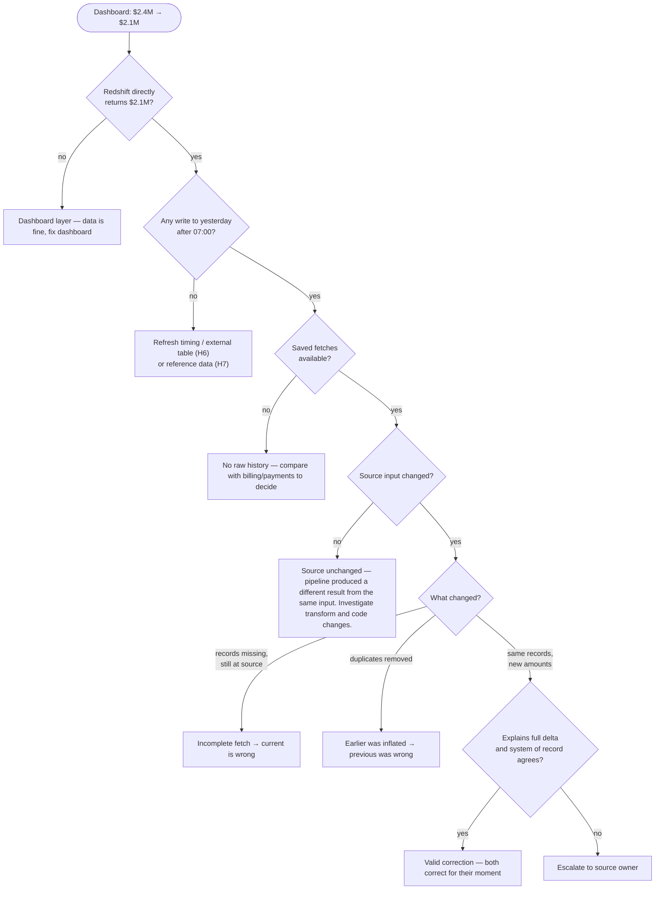
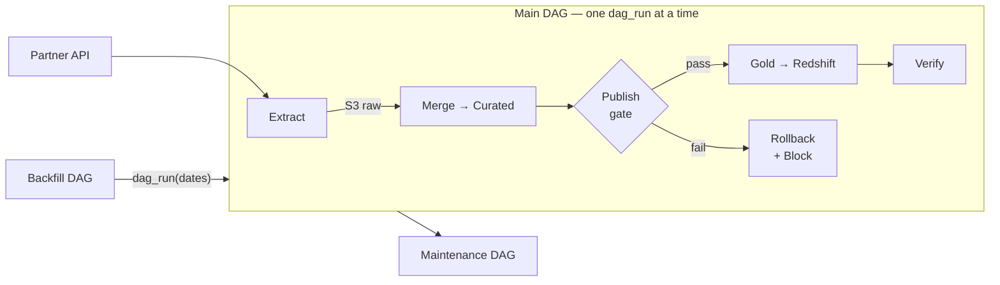
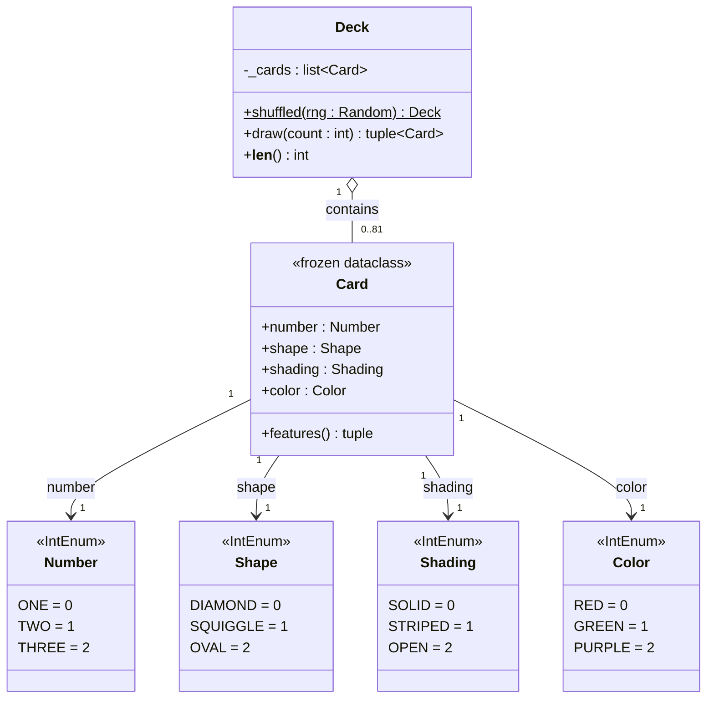
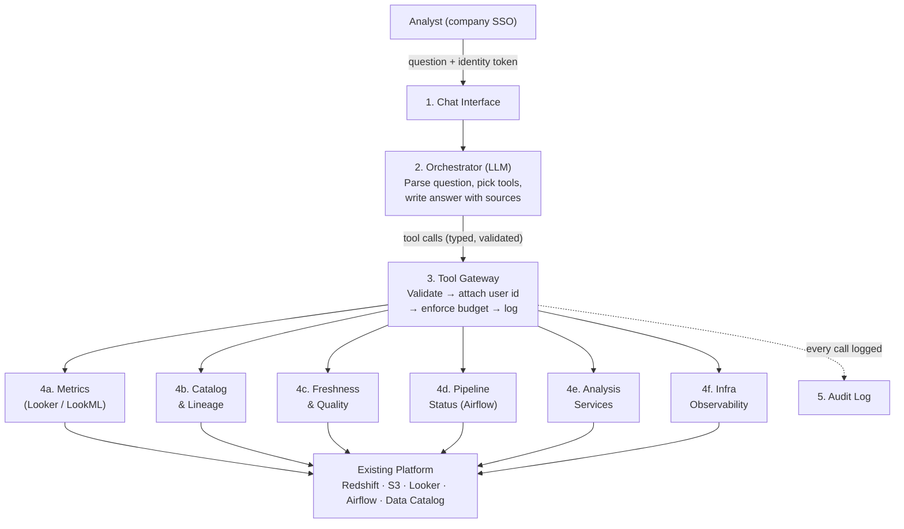

# Senior Data Engineer — Home Assignment

**Candidate:** Rei Sivan  
**Date:** October 2026

---

# 1. Production Incident: The Dashboard Numbers Changed

## My reading of the incident

Three facts from the scenario guarantee that numbers **will** move after 07:00, even when nothing is broken: the source **sends late corrections by design**, the pipeline **loads incrementally by date**, and there is **no documented data-quality SLA**. So "the number changed" is not, by itself, evidence of a bug.

The incident mixes two separate questions:

- **Data correctness:** is each number an accurate result of the data available when it was computed?
- **Data finality:** was the business entitled to treat the 07:00 number as final?

A legitimate late correction is the most *likely* explanation. But a 12.5% drop is large, and "it's just a correction" is exactly how a real data-loss bug slips through. So I treat it as the leading hypothesis and **prove it rather than assume it**. My top suspect among the bug explanations is a **re-run that re-fetched from the live API**, because that's the failure an inherited, poorly documented pipeline hides best.

A stakeholder found this before we did, and **that** is the failure to fix, even if the number turns out to be right.

### What I don't know yet

Before debugging, three unknowns shape which hypotheses are even possible:

1. **Does the pipeline have a point-in-time (PIT) cutoff?** If there are no saved fetches, no snapshot, no stream offset — every run sees whatever the source has *right now*. A re-run produces a different number **by design**, not by bug.
2. **Is the Redshift model a loaded table or an external table (Spectrum)?** Loaded: S3 changes appear only after a refresh step. External: any S3 write is immediately visible to the dashboard.
3. **What is the DAG schedule, and does the Redshift model join other sources?** The scenario describes APIs, application databases, and event streams. An hourly DAG, or a joined table refreshed by a *different* pipeline (database CDC, event stream), can move the number without anything going wrong in the revenue pipeline itself.

---

## First checks, in order

**Before debugging (~15 minutes):**
- **Size the impact.** Who uses this number, and for what? Has $2.4M already left the dashboard in an export or another team's model?
- **Preserve evidence.** Snapshot yesterday's partition and the warehouse table. Pause only the writer for that date if needed, not the whole pipeline.
- **Acknowledge the stakeholder** (see stakeholder communication below).

**Then walk backwards along the data chain:**

| # | Check | Why at this point |
|---|---|---|
| 1 | **Reproduce in Looker:** current value, affected dates, filters, time zone | Confirms it's real and how wide it is |
| 2 | **Query Redshift directly** with the dashboard's SQL | If Redshift ≠ Looker, it's a dashboard issue and the data is fine |
| 3 | **Redshift model setup:** loaded table or external (Spectrum)? What sources does it join? | External tables expose S3 changes instantly. A join with another table means another pipeline can move the number independently. |
| 4 | **DAG schedule and runs after 07:00:** how often does the DAG run? Airflow attempts (retries, cleared tasks, backfills), S3 write times, Redshift load history | If the DAG runs hourly, the change is expected. If daily, something wrote after 07:00 — find which run. |
| 5 | **Compare the two data states** (behind $2.4M and $2.1M) record by record | Turns "$300K drop" into "*these* records changed *this* way" |
| 6 | **Compare raw API data on S3** for yesterday: file/folder timestamps, new or changed files after 07:00, diff the content (records added, removed, amounts changed) | Separates "the source sent different data" from "our pipeline changed it". If no raw files are saved per run, there's no PIT — that's itself a finding. |
| 7 | **Trace a few delta records end to end:** API → raw → curated → Redshift → Looker | Confirms *where* each record changed |

Each check rules out a whole section of the chain before spending time on the expensive ones.

**Edge case:** calling the API *now* only helps if the source is idempotent (same request → same data every time). If corrections can change past data at any moment, the current response doesn't tell me what it returned at 06:00 — only saved raw files on S3 can.

---

## Hypotheses and evidence

Two cautions: hypotheses can **coexist** (a re-run can pick up a correction *and* be cut short), and "eliminated" needs **positive evidence** — a green DAG eliminates nothing.

| # | Hypothesis | Key evidence for | Key evidence against |
|---|---|---|---|
| H1 | **Dashboard layer:** Looker cache, filters, time zone | Redshift returns a different number | Dashboard SQL against Redshift also returns $2.1M |
| H2 | **Legitimate correction:** refunds, cancellations | Saved fetches show changed amounts explaining the full $300K | Source responses are unchanged; a later layer introduced the difference |
| H3 | **Incomplete fetch despite success:** paging stopped early, swallowed error | Records from an earlier fetch are absent now but still exist at the source | All pages retrieved; IDs reconcile |
| H4 | **Transform / write error:** partition replaced with a subset instead of merged | Raw is complete but curated or Redshift drops records | Records reconcile across layers |
| H5 | **Re-run re-fetched from the live API** after 07:00 — no PIT, so the same call returned different data and overwrote | Airflow attempt after 07:00; new raw files with this morning's timestamps | No writes to yesterday after 07:00 |
| H6 | **Warehouse refresh issue.** Loaded table: the refresh does DELETE then INSERT — a query between the two sees missing records. External table (Spectrum): reads S3 directly, so any S3 write after 07:00 changes the dashboard with no Airflow run or Redshift load. | Loaded: gap between delete and insert in Redshift logs. External: S3 write times after 07:00 with no corresponding refresh. | Loaded: single-transaction refresh. External: no S3 writes after 07:00. |
| H7 | **Another input source changed.** The scenario has three source types (APIs, databases, event streams). Whether the pipeline builds one curated table from all of them, or separate pipelines feed separate tables joined in Redshift — either way, a different source updating after 07:00 can move the number while the API data stays the same. | Revenue records from the API are identical in both states; data from another source changed after 07:00 | All sources and joined tables unchanged between the two states |
| H8 | **Code/config change in the pipeline.** The scenario says no dashboard deployment, but a recent merge to the DAG or transform logic could introduce a bug — or a bug fix that re-processed data with different logic. | Git log / deploy history shows a recent commit to pipeline code; the change alters how records are aggregated, filtered, or deduplicated | No commits to pipeline code since the last known-good run; same code version produced both results |

**H5 is my top suspect** because every component does exactly what it was designed to do — the retry succeeds, each task is idempotent — yet the system produces a surprise. Without a PIT cutoff, the fetch reads a live source and can return different data each time. "Idempotent tasks" does not mean an idempotent pipeline when the first step's input changes.

**H7 matters** because it fits every stated fact: no deployment, Airflow green, the API behaving correctly, and still a different number. It's easy to miss because the investigation naturally focuses on the API source, not on the other inputs (database, event stream) that also feed into the final number.

---

## Which number is correct?

**The question frames this as either/or, but both numbers can be correct.** Each may be **valid for the data available at its moment**: $2.4M as a valid provisional view at 07:00, $2.1M as the valid updated view.

**How I decide:**
- Reconstruct both states and **explain the full $300K** at record level. Totals can hide offsetting errors.
- Judge against the **system of record** (billing/payments), not just the API — the API is a copy, not the source of truth.
- If there are no saved raw files on S3 and no access to the billing/payments system, I report correctness as **unverified** rather than pick a number.



**Edge cases:** if one version is wrong, the other isn't automatically right — validate before using it as a recovery baseline. If the source stops returning cancelled records instead of sending a cancellation flag, "cancelled" and "lost" look the same.

---

## Stakeholder communication and temporary mitigation

**First message (within ~15 minutes):**
> We're investigating the change in yesterday's revenue from $2.4M to $2.1M. We haven't confirmed whether it's a source correction or a processing issue. Until then, treat yesterday's figure as provisional. Next update by 10:30, even if we're still investigating.

I don't call $2.1M wrong or promise to restore $2.4M. I also ask whether the number feeds a **time-sensitive decision**.

**Mitigation depends on the finding:**

| Finding | Response |
|---|---|
| Valid correction | Keep $2.1M, explain the correction. No rollback. |
| Bad data published | Stop publishing for that date. Serve the previous **verified** version, labelled as stale. |

**Never:** hand-edit numbers in the warehouse, or fix it quietly. Both destroy the trail the next investigation needs.

---

## Permanent changes

**"Prevented" is partly the wrong goal.** Valid corrections **should** reach users — through new fetches, not re-runs of old ones. Each fetch is a point-in-time snapshot: immutable, saved, and comparable. Corrections arrive naturally in the next fetch and update curated and the warehouse. The goals are: prevent defective data from being published, detect significant revisions before anyone asks, and make every change **traceable** (fetch N vs fetch N+1).

1. **Agree a finality rule with the business.** Revenue definition, freshness target (07:00), when a day becomes final, a named owner. The dashboard shows *provisional / final* and the last-update time. Our promise can't be stronger than the source's promise to us.
2. **Establish a point in time (PIT).** Store API responses per run, immutable. The pipeline only reads from saved raw data on S3 — extraction is a separate process, not a task in the DAG. A DAG re-run can never trigger a new fetch, so it always produces the same result from the same saved data. The saved fetch *is* the PIT. This closes H5.
3. **Merge corrections by key into the curated table, don't overwrite partitions.** The API has no total count, so an incomplete fetch that replaces a partition silently deletes real data. Downstream layers (gold, Redshift) are recomputed from curated.
4. **Control when the dashboard sees changes.** If the DWH is a loaded table, load it once a day at a fixed time. If it's an external table (Spectrum), it reads S3 directly — so control when curated is updated instead. Either way, stakeholders see numbers change once, at a predictable time.
5. **Separate processing failures from expected revisions.**
   - Processing failure (incomplete fetch, duplicates, records vanishing): **block publishing** and **open a production incident** — a stale number beats a wrong one, and this shouldn't happen.
   - Corrections updating previous dates are **expected by design** — no alert needed. Monitor for significant diffs (e.g. >10% change) as an anomaly detection concern, not a routine notification.
   - **Prevent mid-day changes:** publish once a day at a known time so numbers don't move unexpectedly (depends on a data freshness SLA, which isn't defined yet).

---

---

# 2. Design a Reliable, Large-Scale Incremental Pipeline

## Requirements and assumptions

**Requirements (from the brief):**

| Area | Requirement |
|---|---|
| **Source** | REST API with date-range + pagination. Records corrected up to 7 days. Rate-limited; partial failures possible. No reliable total count. New fields appear without notice. |
| **Scale** | ~250M records/day (~1.25 TB raw JSON/day), growing ~50%/year. 3 years of history to backfill. |
| **Consumers** | BI dashboards in Looker (via Redshift) by 07:00 daily. Data scientists query the same curated data on the lake with Spark and Athena — no separate silos. |
| **Privacy** | GDPR deletion requests applied across all history within 30 days. |
| **Finance** | Reproduce any reported number exactly as it looked on a past reporting date. |
| **Operability** | Daily pipeline; operator can re-run any historical date range safely. |

**Assumptions:**

- **A1.** AWS — S3, Redshift and Athena are already in place.
- **A2.** Each record has a stable `record_id` and a `user_id`.
- **A3.** `event_date` is in UTC, and "07:00" is also UTC.
- **A4.** The API has **no "modified since" filter or change feed.** If it does, the design gets much simpler.
- **A5.** The API returns **~1,000 records per page.**
- **A6.** The API is **not idempotent for past dates** — the same request on different days can return different data (corrections). The API is a live view, not a snapshot.
- **A7.** Rate limit is **~50 calls/s sustained.**

**Before writing any code** I'd validate A4–A7 with the partner. Each answer changes the design more than any engineering choice. A "modified since" filter (A4) alone would eliminate ~87% of daily API calls and remove the 2-year growth ceiling. A bulk export for history would reduce the backfill from ~90 days to days. These aren't nice-to-haves — they're the difference between a design that scales indefinitely and one with a hard expiration date.

### The numbers that shape every decision

| Quantity | Calculation | Result |
|---|---|---|
| Size per record | 1.25 TB ÷ 250M | ~5 KB JSON |
| API calls for 1 day | 250M ÷ 1,000 | ~250K calls |
| Daily run (1 new + 7 correction days) | 8 × 250K | **~2M calls** = ~23 calls/s sustained |
| In 2 years (+50%/yr → 2.25×) | 2.25 × 2M | ~4.5M calls/day = ~52 calls/s — **hits the rate limit** |
| Curated storage per day (Parquet, ~10× compression) | 1.25 TB ÷ 10 | ~125 GB/day |
| Backfill (3 years, accounting for growth) | 365 × (250M + 167M + 111M) | ~190B records, **~100 TB Parquet** |
| Backfill API calls | 190B ÷ 1,000 | **~190M calls** |
| Backfill duration at 25 spare calls/s | 190M ÷ 25 ÷ 86,400 | **~90 days** |

**What these numbers tell me:**
- **Time is bounded by the API, not by us.** No amount of AWS spend makes the partner's API respond faster. We can scale compute and storage freely — the rate limit is fixed.
- **The backfill takes ~90 days.** That's a project with its own staffing and monitoring, not a weekend job.
- **At 50%/yr growth, the daily run approaches the rate limit in ~2 years.** The adaptive correction window (see below) reduces effective daily calls by ~30%, extending headroom to ~3 years.
- **Validating assumptions A4–A7 with the partner matters more than any architecture decision.**

---

## Architecture: one copy, many readers

The requirement that Spark, Athena, and Redshift all query the same data without silos is the constraint that forces the table format choice.

### The table format is the most important choice

| | Plain Parquet (Hive) | **Apache Iceberg** | Delta Lake | Apache Hudi |
|---|---|---|---|---|
| Spark | Read/write | Read/write | Read/write | Read/write |
| Athena | Read | **Read + write** | Read only | Read only |
| Redshift Spectrum | Read | Read (Glue catalog) | Read via manifest (can go stale) | Read (CoW only) |
| Record-level update/delete | No | Yes | Yes | Yes |
| Atomic commits | No | Yes | Yes | Yes |
| Time travel / rollback | No | Yes (tags + branches) | Time travel only | Time travel; savepoints |
| Schema evolution | Fragile | Yes | Yes | Yes |
| Change partitioning without rewrite | No | **Yes** (partition evolution) | No | No |

**Choice: Apache Iceberg.** Every engine we need can read one copy. Time travel enables rollback on bad merges. AWS treats it as the first-class open table format.

**Why not Hudi:** stronger at high-frequency upserts, but operationally heavier (compaction tuning, timeline management). Our upserts touch at most 8 partitions/day — Iceberg's simpler operational model is worth more.

**Why not Delta:** Redshift reads it through manifest files that can go stale; tooling is partially under Business Source License.

### What lives where

| Store | What | Format | Who reads it |
|---|---|---|---|
| **S3 raw** | API responses as received | Plain JSON files | Pipeline only (staging) |
| **S3 curated** | Merged, deduplicated records — single source of truth | Iceberg table (Parquet, zstd, Glue catalog) | Data scientists (Spark, Athena) |
| **Redshift gold** | Pre-aggregated dashboard tables with `reporting_date` for finance | Loaded tables | Looker, finance |

No curated data is copied into Redshift. Data scientists read the lake directly — one copy, no silos. Redshift holds only small gold aggregates.

**How gold gets to Redshift:** Redshift queries the curated Iceberg table directly via an external schema registered in Glue Data Catalog. Gold aggregates are computed inside Redshift with SQL (`DELETE + INSERT` per affected date, one transaction). No Spark involvement, no connector, no Redshift credentials in the EMR environment.

### Components

| Component | Choice | Why |
|---|---|---|
| Extraction | **ECS Fargate** (~$0.04/vCPU-hr) | I/O-bound (waiting on API). No cluster to manage, pay per second. |
| Processing | **Spark on EMR Serverless** (~$0.05/vCPU-hr) | Hundreds of GB/day needs distributed compute. Serverless = no idle cluster. |
| Warehouse | **Redshift** ($0.375/RPU-hr serverless) | Already in place. Gold only. |
| Orchestration | **Airflow** (existing) | No reason to add a second tool. |
| Extraction state | **DynamoDB** (on-demand) | Small writes (page cursors), conditional writes for chunk ownership. |
| Catalog | **AWS Glue Data Catalog** | Native for Athena, Redshift, EMR. Serverless. |

### Partitioning, file layout, write mode

- **Partition by `event_date`** (day). Matches how we pull, how corrections arrive, how analysts filter.
- **Sort files by `user_id`** within each partition. GDPR deletes for one user can skip most files (min/max column stats).
- **Merge-on-read (MoR)** for the curated table. Writes are fast. Nightly compaction of changed partitions eliminates the read penalty before the 07:00 dashboard window.

---

## The real problem: corrections, deletes, and an API that can't tell you what changed

### The correction window drives the API budget

Without a "modified since" filter (A4), the only way to catch corrections is to re-pull the entire 7-day window daily. That means **8 full days of data per daily run**.

**Each date is pulled 8 times over its life.** The 8th pull catches corrections that landed on the 7th day after the event.

**Edge case — fencepost error on the correction range:** the daily run must pull 8 dates: yesterday (fresh) plus the 7 days before it (corrections). A common mistake is pulling only 7 days back instead of 8, dropping the oldest date — the one making its final pass. If that last pass is missed, any correction that landed on that date is silently lost. Guard: if the pull for the oldest date in the window fails, keep it flagged as "open" and re-pull next run.

**Schedule:** DAG starts ~08:00 UTC. Extraction pulls all 8 dates throughout the day at ~35 calls/s (spreading the load). Processing starts when extraction finishes (~00:00). Dashboards update once, predictably (~05:00).

### How the rate limiter works

Multiple ECS workers extract pages in parallel, but they all share one rate limit. A **token bucket** backed by Redis coordinates across workers.

| Design choice | Decision | Why |
|---|---|---|
| 429 response | Stop requesting, respect `Retry-After` header, reduce fill rate | A 429 means we've hit the actual limit. Back off immediately. |
| 5xx response | Retry with exponential backoff | Server error, not rate limit. Cap at 5 retries, then mark chunk failed. |
| Priority lanes | **Three queues:** (1) yesterday, (2) corrections, (3) backfill | Backfill never takes a slot when yesterday or corrections are waiting. |

### Merge, not overwrite

| Strategy | Pros | Cons |
|---|---|---|
| **Overwrite** partition with fresh pull | Simple. Deletes automatic. | Rewrites ~1 TB/day. **If the pull is incomplete, it silently deletes real data.** |
| **MERGE** by `record_id` | Writes only what changed. Incomplete pull delivers corrections without deleting anything. | Must hash records, compare fetch timestamps. Deletes are deferred. |

**Choice: MERGE.** The deciding reason isn't performance — it's safety. The API gives no total count, so we can never prove completeness. With merge, completeness and correctness are independent: a partial pull applies what it has and alerts about the rest. With overwrite, they're coupled: a partial pull silently destroys data.

### What "idempotent re-run" means when the source isn't idempotent

- **Re-run from saved raw (< 21 days old):** deterministic. Same input → same output. **This is the PIT.**
- **Re-run with re-fetch (raw expired):** a new observation, not a replay. Handled by the "newer `fetch_time` wins" rule.

| Stage | What we do |
|---|---|
| **Extract** | Fixed name per page (`run/date/page`). Retry = overwrite same file. Resume from DynamoDB cursor. |
| **Merge → Curated** | MERGE by `record_id`: hash content, newer `fetch_time` wins. Same data merged twice = no change. |
| **Gold → Redshift** | DELETE + INSERT per affected date, **one transaction**. |
| **GDPR** | Anonymising an already-anonymised row is a no-op. |

**One dag_run at a time** (Airflow pool of 1). The rate limiter is shared — parallel extraction doesn't increase total calls/s. One writer eliminates all concurrency issues.

### Failure scenarios

| Failure | Protection |
|---|---|
| **Run dies mid-merge** | Iceberg commits are atomic. Table unchanged. Extraction resumes from DynamoDB cursor. |
| **Data passes but is wrong** | Publish gate checks merge result. Fail → Iceberg rollback to previous snapshot. |
| **Redshift unreachable** | Retry with backoff. Curated is already committed — Looker serves stale gold, labelled with last-refresh time. |
| **Extraction runs past midnight** | Alert at 00:00. If processing can't finish by 06:00, serve previous day (labelled stale). |

### How an operator re-runs a historical range

1. **Choose dates and source.** Under 21 days: raw is on S3, no API calls. Older: re-extract in the backfill lane.
2. **Dry run:** shows what would change. Nothing written.
3. **Run:** trigger a `dag_run` with date parameters — same code path as daily and backfill.
4. **Same publish gate.** Finance `reporting_date` rows in Redshift are never overwritten once final — a re-run that would move a reported number → revision log + alert.

---

## The tension between GDPR and finance

GDPR says delete the person. Finance says keep the numbers unchanged. You can't do both with a physical delete.

### Anonymise, not delete

Replace `user_id` with `HMAC(user_id, secret_salt)`. All records for the same user get the same hash, so `COUNT(DISTINCT user_id)` is unchanged. Personal fields (name, email) are zeroed. Revenue totals and user counts stay identical.

**The suppression list prevents re-entry.** On a GDPR request, the user's hash is added immediately. Every extraction anonymises suppressed users before saving raw. Every merge checks against the list.

**Timeline:**

| Layer | Action | When |
|---|---|---|
| Suppression list | Add user hash | Day 0 |
| Raw JSON on S3 | 21-day S3 lifecycle expires them. New pulls pre-anonymised. | Gone by day 21 |
| Curated (Iceberg) | Weekly GDPR job anonymises rows | Within 7 days |
| Old Iceberg snapshots | Expire + orphan file cleanup | ~7 days after job |
| Gold (Redshift) | Aggregates only, no `user_id` | Nothing to do |

**Worst case: ~15 days.** Within the 30-day requirement.

### Finance reproducibility

| Finance asks | How |
|---|---|
| "What did we report on March 15?" | `WHERE reporting_date = '2026-03-15'` in Redshift gold |
| "What's the right number today?" | Recompute from today's curated (may differ — corrections, GDPR) |

Once a date is final, its gold row keeps its `reporting_date` and is never overwritten. GDPR anonymisation doesn't change the reported numbers because cardinality and amounts are preserved.

---

## Knowing the data is correct, not just that the job succeeded

### Signals from extraction (ECS → CloudWatch)

| Signal | What it catches | Alert when |
|---|---|---|
| `pagination_end_reason` | Extraction stopped early but looked finished | Anything other than "normal end" |
| Empty pages with HTTP 200 | API returned success but no data | Any occurrence |
| Records fetched per date | Volume dropped | Below same-weekday baseline |
| Records bucketed by event hour | Skipped chunk shows as a gap in one hour | An hour below its usual share |
| Schema hash vs known schema | Type change without notice | Hash mismatch → **block extraction** |

### Signals from merge (Spark → CloudWatch)

| Signal | What it catches | Alert when |
|---|---|---|
| Records inserted / updated / disappeared | Unusual correction volume, or incomplete pull | `disappeared` above baseline |
| Day-over-day total per `event_date` | Published date shrank or grew unexpectedly | Change beyond ±5% |
| Curated totals vs Redshift gold totals | Load error | Any mismatch |

### The publish gate

Runs after merge. Reads the metrics above — doesn't re-scan data. Three outcomes:

| Result | Action |
|---|---|
| **Pass** | Proceed to gold. |
| **Doubt** (one signal slightly off) | Proceed with corrections and inserts, **skip deletes**. Alert on-call. |
| **Fail** | Re-pull once automatically. If still fails, block that date — Iceberg rollback. |

### Schema evolution

**New field (additive):** add a nullable column to curated via Iceberg schema evolution. No disruption.

**Type change or removed field (breaking):** detected at extraction by comparing schema hash. Mismatch → block, alert, quarantine raw.

---

## Cost and performance: where the money goes

### Cost drivers (ranked)

| # | Cost area | Monthly estimate | How to reduce |
|---|---|---|---|
| 1 | **NAT gateway** (~1.25 TB/day at $0.045/GB) | ~$1,700 | Run extract workers in public subnet |
| 2 | **S3 storage (curated)** (~100 TB at $0.023/GB) | ~$2,300+ | zstd; S3 Intelligent-Tiering for old partitions |
| 3 | **Spark compute** (EMR Serverless) | ~$1K–3K | Graviton instances; spot capacity |
| 4 | **S3 raw** (21 days × ~1.25 TB/day) | ~$600 | Already short retention |
| 5 | **Athena** ($5/TB scanned) | Variable | Partition pruning; sorted files |
| 6 | **Redshift** ($0.375/RPU-hr serverless) | ~$200–800 | Auto-suspend; reservations |

### Daily timeline (UTC)

| Time | Step | Estimate |
|---|---|---|
| ~08:00 | DAG starts. Extract 8 dates at ~35 calls/s. | ~16h |
| ~00:00 | Extraction done. Merge raw into curated. | ~30–45 min |
| ~00:45 | Publish gate. Rollback if fail. | ~15 min |
| ~01:00 | Redshift refreshes gold. | ~20–30 min |
| ~01:30 | Looker cache refresh. | ~5 min |
| 01:30–07:00 | **Buffer (~5.5h)** for one full retry. | — |

### The hard ceiling: the partner's rate limit

The bottleneck is the partner's rate limit, not our infrastructure. Solutions, ranked by impact:

1. **"Modified since" filter (partner-side)** — reduces daily calls from ~2M to ~50K–250K. Eliminates the ceiling.
2. **Partner pushes changes (webhook/stream)** — eliminates the rate limit entirely. Much more complex (lambda architecture).
3. **Higher rate limit (partner-side)** — buys time proportional to the increase.
4. **Larger pages (partner-side)** — linear improvement.
5. **Adaptive correction window (our side):** measure actual correction distribution over 4–6 weeks. Pull days 1–3 daily, days 4–5 every other day, days 6–7 twice per week. Takes 8 full pulls/day down to ~5.6 — a **~30% guaranteed reduction**. Combined with diff-based early termination (~15–25% further reduction), extends headroom well past the original 2-year ceiling.

## Backfill: the 90-day project

At ~190M API calls and 25 spare calls/s, the initial backfill takes **~90 days**. Key decisions:

| Decision | Choice | Why |
|---|---|---|
| When to start | Before anything else | It's the critical path to go-live. |
| Priority | Lowest lane — behind daily and corrections | 07:00 must never be delayed. |
| Order | Newest dates first | Most valuable data arrives first. Go-live may be possible before full 3 years are loaded. |
| Code | Same main DAG with date parameters | No special backfill code path. One fix, not two. |

**Go live with partial history.** Newest-first ordering means analysts start working on recent data while the backfill continues. The boundary is visible via a `backfill_status` view.

---

## The pipeline — all tasks



## Simple where possible, complex where forced

**Kept simple:** one Iceberg table, one dag_run at a time, one publish a day, partition by day only, Redshift pulls gold via external schema, finance versions as a `reporting_date` column.

**Complexity I accept, each because a requirement forces it:**

| Complexity | What forces it |
|---|---|
| Throttled, resumable, prioritised extraction | Rate limits + partial failures + 07:00 deadline vs backfill |
| MERGE with content hash and "newer wins" | Corrections without full rewrites; safe re-runs; no total count |
| Publish gate + Iceberg rollback | No total count means we can't trust the API's completeness |
| Suppression list at extraction and merge | GDPR + finance + safe re-runs all interact |

## Questions for the partner (priority order)

| Question | Why it matters |
|---|---|
| "Modified since" filter or change feed? | Reduces daily calls from ~2M to ~300K. Eliminates the 2-year ceiling. |
| Bulk export endpoint for history? | Backfill drops from ~90 days to days. |
| Real rate limit, and can it be raised? | Sets whether we meet 07:00. |
| After 7 days, is a date locked? | Simplifies drift checks, raw retention, reconciliation. |
| Can we get a separate API key for the backfill? | A second key doubles effective throughput. |

---

---

# 3. Data Modeling & SQL

## Dialect and shared assumptions

**Dialect: PostgreSQL.** Its **range types** express the subscription rule directly: `daterange(start_date, end_date, '[)')` means "start included, end excluded, NULL end = no end". That rule is the main source of mistakes in these queries, so writing it once, explicitly, makes the queries easier to read and harder to get wrong. I ran and tested all queries on PostgreSQL (see "How I tested the logic" and the `q3_sandbox`). On Redshift, the logic is the same but range types aren't available — the range checks become explicit conditions and the date list comes from a calendar table.

**Assumptions:**
- `event_ts` is a `TIMESTAMP` holding UTC, and the session runs with `SET TIME ZONE 'UTC'`.
- A subscription is active on day *d* when `start_date <= d < end_date`: `end_date` is the **first inactive** day, so it's excluded. `NULL` `end_date` means still active.
- **"Daily active paying users" means users who are both active and paying on that day.**
- "Last 30 days" = the 30 complete UTC days ending yesterday.
- An event whose `user_id` isn't in `users` still counts as active.

## Three building blocks used by 3a and 3b

**1. A list of the 30 dates (`days`).** Without it, a day with no active paying users would be **missing** from the result instead of showing 0.

**2. Active users per day (`active_users`).** One row per (date, user), with anonymous events removed. `DISTINCT` early: a user with 500 events a day becomes one row before any join. The filter is on the **raw** `event_ts`, not on `event_ts::date`, so an index on `event_ts` can skip everything outside the 30 days.

**3. "Paying on a date".** `daterange(start_date, end_date, '[)') @> d` — "the range contains day *d*".

---

## 3a. Daily active paying users, overall and per product

```sql
WITH params AS (
    SELECT CURRENT_DATE - 1 AS last_day
),
days AS (
    SELECT d::date AS activity_date
    FROM params p,
         generate_series(p.last_day - 29, p.last_day, INTERVAL '1 day') AS d
),
active_users AS (
    SELECT DISTINCT e.event_ts::date AS activity_date, e.user_id
    FROM events e, params p
    WHERE e.user_id IS NOT NULL
      AND e.event_ts >= p.last_day - 29
      AND e.event_ts <  p.last_day + 1
),
valid_subscriptions AS (
    SELECT user_id, product,
           daterange(start_date, end_date, '[)') AS active_period
    FROM subscriptions
    WHERE start_date IS NOT NULL
      AND (end_date IS NULL OR end_date > start_date)
),
active_paying AS (
    SELECT DISTINCT a.activity_date, a.user_id, s.product
    FROM active_users a
    JOIN valid_subscriptions s
      ON  s.user_id = a.user_id
      AND s.active_period @> a.activity_date
)
SELECT d.activity_date,
       COUNT(DISTINCT ap.user_id)                                    AS paying_active_users,
       COUNT(DISTINCT ap.user_id) FILTER (WHERE ap.product = 'pro') AS pro_paying_active_users,
       COUNT(DISTINCT ap.user_id) FILTER (WHERE ap.product = 'mp')  AS mp_paying_active_users
FROM days d
LEFT JOIN active_paying ap ON ap.activity_date = d.activity_date
GROUP BY d.activity_date
ORDER BY d.activity_date;
```

**A user with both products counts once overall** because the overall column is `COUNT(DISTINCT user_id)`. They count once in each product column, via `FILTER`. So **overall ≤ pro + mp**, and the gap equals the number of active users who had both products running on that day.

---

## 3b. Percentage of active users who were paying

```sql
WITH params AS (
    SELECT CURRENT_DATE - 1 AS last_day
),
days AS (
    SELECT d::date AS activity_date
    FROM params p,
         generate_series(p.last_day - 29, p.last_day, INTERVAL '1 day') AS d
),
active_users AS (
    SELECT DISTINCT e.event_ts::date AS activity_date, e.user_id
    FROM events e, params p
    WHERE e.user_id IS NOT NULL
      AND e.event_ts >= p.last_day - 29
      AND e.event_ts <  p.last_day + 1
),
valid_subscriptions AS (
    SELECT user_id, product,
           daterange(start_date, end_date, '[)') AS active_period
    FROM subscriptions
    WHERE start_date IS NOT NULL
      AND (end_date IS NULL OR end_date > start_date)
),
paying_active AS (
    SELECT DISTINCT a.activity_date, a.user_id
    FROM active_users a
    JOIN valid_subscriptions s
      ON  s.user_id = a.user_id
      AND s.active_period @> a.activity_date
)
SELECT d.activity_date,
       COUNT(a.user_id)                                                  AS active_users,
       COUNT(p.user_id)                                                  AS paying_active_users,
       ROUND(100.0 * COUNT(p.user_id) / NULLIF(COUNT(a.user_id), 0), 2) AS pct_paying
FROM days d
LEFT JOIN active_users  a ON a.activity_date = d.activity_date
LEFT JOIN paying_active p ON p.activity_date = a.activity_date
                         AND p.user_id       = a.user_id
GROUP BY d.activity_date
ORDER BY d.activity_date;
```

`NULLIF(..., 0)` returns NULL instead of a division error on a day with no active users. The query also returns the two counts, not only the percentage — a percentage without its base is hard to judge.

---

## 3c. Users with overlapping subscriptions

**Boundary assumptions:**

| Case | Overlap? | Why |
|---|---|---|
| A ends 2026-06-01, B starts 2026-06-01 (renewal) | **No** | `end_date` is the first inactive day, so A's last day is 31 May. |
| A ends 2026-06-02, B starts 2026-06-01 | **Yes** | Both active on 1 June. |
| One or both have `end_date` NULL | Currently active | Overlaps any subscription whose active period intersects. |
| `start_date = end_date` | **Excluded** | Active on no day. Reported separately as a data issue. |
| A `pro` and an `mp` at the same time | **Included**, flagged with `same_product` | Having both products is legitimate; two overlapping same-product subscriptions usually means a duplicate. |

```sql
WITH valid_subscriptions AS (
    SELECT subscription_id, user_id, product, start_date, end_date,
           daterange(start_date, end_date, '[)') AS active_period
    FROM subscriptions
    WHERE start_date IS NOT NULL
      AND (end_date IS NULL OR end_date > start_date)
)
SELECT a.user_id,
       a.subscription_id AS subscription_id_1,
       a.product         AS product_1,
       a.start_date      AS start_date_1,
       a.end_date        AS end_date_1,
       b.subscription_id AS subscription_id_2,
       b.product         AS product_2,
       b.start_date      AS start_date_2,
       b.end_date        AS end_date_2,
       a.product = b.product                    AS same_product,
       lower(a.active_period * b.active_period) AS overlap_start,
       upper(a.active_period * b.active_period) AS overlap_end
FROM valid_subscriptions a
JOIN valid_subscriptions b
  ON  a.user_id = b.user_id
  AND a.subscription_id < b.subscription_id
  AND a.active_period && b.active_period
ORDER BY a.user_id, a.subscription_id, b.subscription_id;
```

`&&` means "the two ranges share at least one day." `*` is the intersection. `a.subscription_id < b.subscription_id` returns each pair once.

---

## How I tested the logic

I ran the queries on PostgreSQL against a 16-user hand-crafted fixture, with "yesterday" fixed to **2026-10-04**. Each user targets one edge case. The full fixture is in `q3_sandbox/app/data.py`; the sandbox also runs the queries against 5,000 random users and compares with an independent Python oracle (`q3_sandbox/app/oracle.py`).

| User | Setup | Expected | Result |
|---|---|---|---|
| u\_pro\_open | `pro` from 1 Sep, open; events at window boundaries | Paying active on 4 Oct; boundary events outside window | ✓ |
| u\_ends\_yesterday | `pro` ending 4 Oct (first inactive day) | Paying on 3 Oct, **not** on 4 Oct | ✓ |
| u\_both\_products | `pro` + `mp` both active | Counts **once** overall, once in each product | ✓ |
| u\_starts\_yesterday | `mp` starting 4 Oct | Paying active on 4 Oct | ✓ |
| u\_paying\_no\_events | Paying, no events | Not counted (not active) | ✓ |
| u\_renewal | One `pro` ends 26 Jun, next starts 26 Jun | **No** overlap | ✓ |
| u\_duplicate\_pro | Two overlapping `pro` | Counted once; 3c pair with `same_product = true` | ✓ |
| u\_zero\_length | `start_date = end_date` | Excluded | ✓ |
| u\_three\_way | Three overlapping subs | **Three** 3c pairs | ✓ |

All edge cases passed against both hand-computed expectations and the Python oracle. The sandbox runs with `docker compose up --build` in `q3_sandbox/`.

## How I'd validate on production data

1. **Profile the inputs.** Look for `end_date < start_date`, `product` values other than `pro`/`mp`, duplicate `subscription_id`s, events from unknown users, future events.
2. **Internal consistency rules.** Overall ≤ pro + mp; overall ≥ max(pro, mp); paying active (3b) = overall (3a) on the same day; exactly 30 rows.
3. **Compare with independent sources.** Billing system (paying subscribers must be ≥ our paying active users). Existing DAU dashboard.
4. **Spot-check real users by hand.** Trace events and subscriptions for users from each interesting group.

## How I'd model this in production

Build one daily table — **`fct_user_daily`**: one row per (date, active user), with `is_paying`, `has_pro`, `has_mp`. Built incrementally each day. 3a and 3b become simple `GROUP BY`s, and Looker reads it directly. Every metric uses one shared definition of "active" and "paying."

**Code:** [`q3_sandbox/`](q3_sandbox/) — Docker Compose sandbox (Postgres 16 + Python app + Jupyter notebook). SQL queries in [`q3_sandbox/queries/`](q3_sandbox/queries/). Run with `docker compose up --build`.

---

---

# 4. Set

## Reading of the question

"Draw three unique cards, decide whether they form a set, repeat until a set is found or the deck is empty."

I read it literally: shuffle the deck, draw 3 cards, check them, **discard them** if they aren't a set, draw the next 3. The game ends at the first set, or when fewer than 3 cards are left. With 81 cards that's **at most 27 rounds**.

This is not how the real table game works (12 cards on the table, search among all of them). I discuss that version under "Alternatives" below.

## Design

Each game element maps to its own module, with a single responsibility. Dependencies flow in one direction: Feature → Card → Deck → Rules → Game → interfaces.



**Functions (not classes):** `is_set(Card, Card, Card) → bool` is a pure function in `rules.py`. `play(Deck, on_round?) → GameResult` in `game.py` orchestrates the game loop.

### Module summary

| Module | Element | Responsibility |
|---|---|---|
| `features.py` | Feature | Four enums, three values each, numbered 0–2 |
| `card.py` | Card | Immutable, hashable value object — O(F) per card |
| `deck.py` | Deck | Generates all 81 cards; shuffles with injected RNG; draws from the top in O(1) |
| `rules.py` | Matching rule | `is_set(a, b, c)`: pure function, O(F) time, O(1) space |
| `game.py` | Game loop | `play(deck) → GameResult`: O(N · F) time, O(N) space |
| `__main__.py` | CLI | `--seed`, structured logging |
| `web.py` + `static/` | Web UI | Thin HTTP layer over `play()`, returns JSON |

### Key design decisions

- **Enums, not strings.** A typo like `"purpel"` cannot produce a card. The integer values (0, 1, 2) enable the mod-3 arithmetic.
- **Frozen dataclass with `slots=True`.** Immutable, hashable, compact. Cards can safely go into Python `set` objects.
- **Deck generated, not enumerated.** `itertools.product` over the four feature enums produces every combination exactly once — 3⁴ = 81 by construction.
- **Randomness injected.** `Deck.shuffled(random.Random(seed))` makes tests deterministic and games replayable.
- **Drawing pops from the end** — O(1) per card, not O(N).

## The matching algorithm

For each feature, the three values must be all the same or all different. The only forbidden case is **exactly two the same** — exactly when the set of the three values has size 2:

```python
def is_set(first, second, third) -> bool:
    if len({first, second, third}) != 3:
        raise ValueError("a set needs three different cards")
    return all(
        len({a, b, c}) != 2
        for a, b, c in zip(first.features, second.features, third.features, strict=True)
    )
```

`all(...)` stops at the first feature that fails.

**Alternative: the mod-3 trick.** With values 0, 1, 2, three values are all the same or all different exactly when their sum is divisible by 3. I kept the set-size version because it reads like the rules.

## Complexity summary

| Element | Time | Space |
|---|---|---|
| Feature (enums) | O(1) | O(1) |
| Card (create / hash / eq) | O(F) | O(F) |
| Deck (build + shuffle) | O(N) | O(N) |
| Deck.draw(k) | O(k) | O(k) |
| is_set | O(F) | O(1) |
| **Whole game** | **O(N · F)** | **O(N)** |

With F = 4 and N = 81, O(N · F) = O(N).

## What the program will usually report

A random three-card draw is a set with probability **1/79**. Over up to 27 draws:

> P(at least one set) ≈ 1 − (78/79)²⁷ ≈ **29%**

About 7 games in 10 end with an empty deck and no set. Verified by simulating 20,000 seeded games: 29.0% found a set.

## Alternatives

**A. Keep drawn cards and search them all (closer to the real game).** For any two cards, the third card that completes a set is uniquely determined: for each feature it's `(-a - b) % 3`. When a new card arrives, pair it with every card in the pool, compute the missing third and look it up in a hash set. O(n²·F) for the whole game. A known result (Pellegrino 1971) proves the largest cap set in GF(3)⁴ has 20 cards, so a set is **always found by the 21st card**. I didn't code it because the question says "draw three cards and decide whether *those three* form a set."

**B. Encode each card as one integer 0–80** (base-3 digits). Fastest, but the code no longer reads like the game. Only worth it for millions of simulations.

## How I tested it

39 pytest tests (`q4/tests/`):

- **Deck:** 81 cards, all different; the example card appears exactly once; drawing never repeats; same seed = same order; errors for duplicates and over-drawing.
- **Rule:** hand-made sets and non-sets; card order doesn't matter; repeated card rejected.
- **Exhaustive check:** the full deck contains exactly **1,080 sets** (81·80/6 = 1,080). The test checks all 85,320 triples.
- **Game:** stops at the first set; returns "no set" when the deck runs out; 200 seeded full games all take 1–27 rounds.
- **One test per instruction** (`test_requirements.py`): 300 seeded games verify that every decision matches an independent rule (the mod-3 check, not `is_set` itself).
- **Mutation testing:** broke the code five ways and confirmed the tests catch all five.
- **Web UI:** the page loads; `/api/play` returns rounds in order; same seed replays; bad seed gives 400.

## Running the program

**Code:** [`q4/`](q4/) — Python 3.10+, standard library only (pytest for tests).

```bash
cd q4
python -m set_game --seed 3         # play one game
python -m set_game.web              # web UI at http://127.0.0.1:8765
python -m pytest -q                 # 39 tests
```

---

---

# 5. AI / Data Agent Architecture

## The idea in one paragraph

The agent is a **coordinator, not a database user**. The language model (LLM) does what it's good at: understanding the question, choosing which tools to call, and writing a clear answer. It does **not** compute numbers, decide permissions, or read data on its own. Every fact in an answer comes from a **deterministic tool** (plain code with fixed behaviour) that runs **as the analyst who asked**. So the agent can never see more than that analyst already can, and every number can be traced back to a query.

## Design principles

1. **The agent has no access of its own.** Every tool call runs with the asking user's identity. The agent is never a "super user".
2. **Read-only.** No tool can write, delete, re-run a pipeline or change a dashboard.
3. **Governed definitions first.** "DAU" means the company's official definition from the metric layer, not whatever SQL the LLM invents.
4. **Every number has a source.** Each figure links to the query, dashboard or log line that produced it. No source, no number.
5. **Check the data before explaining the data.** Before saying why a number moved, check that the data is complete and fresh.
6. **"I don't know" is a valid answer.**

---

## Components and access boundaries



| # | Component | What it does | Uses an LLM? |
|---|---|---|---|
| 1 | **Chat interface** | Where analysts ask. Signs the user in with SSO. | No |
| 2 | **Orchestrator** | Reads the question, decides which tools to call, writes the answer with sources. | **Yes**, the only place |
| 3 | **Tool gateway** | Validates inputs, attaches user identity, enforces budget, logs. | No |
| 4a | **Metrics tool** | Gets metric values through Looker's API, using official definitions. | No |
| 4b | **Catalog & lineage** | "Which dashboards use this metric?" "Where does this table come from?" | No |
| 4c | **Freshness & quality** | "When was this table last loaded? Is yesterday complete?" | No |
| 4d | **Pipeline status** | Airflow run history, failed tasks, error log excerpts. | No |
| 4e | **Analysis services** | Fixed calculations: break a change down by segment, compare periods, flag anomalies. | No |
| 4f | **Infra observability** | Container events, OOM kills, CPU/memory spikes when Airflow logs don't explain why. | No |
| 5 | **Audit log** | Who asked what, which tools ran, what data was returned. | No |

**Why tools are typed and narrow.** A tool like `get_metric(name, date_range, group_by)` is much safer than "run any SQL". Its inputs can be checked, its cost is predictable, and its result is correct by construction.

**The orchestrator has a budget:** max ~10 tool calls per question, a hard wall-clock timeout (60 seconds), and a total query cost ceiling.

---

## End to end: "Why did DAU drop yesterday?"

**Step 1: Identify the user.** The chat interface already knows it's Dana (company login).

**Step 2: Understand the question (LLM).** Turn the text into a structured request: `metric = DAU, date = yesterday, question = explain a change`. If multiple DAU-like metrics exist, use the **certified** one. If none is certified, **ask** rather than guess.

**Step 3: Resolve the metric (no LLM).** Find the certified DAU metric in LookML: definition, owner, SQL.

**Step 4: Check the data first (no LLM).** Is yesterday's load finished? Is the row count normal? Is the date still "open" (late events may arrive)? If the data is incomplete: *"Yesterday's events are only 61% loaded; DAU will likely rise when it completes."*

**Step 5: Measure the drop (no LLM).** DAU for yesterday and the previous 28 days: yesterday 182K vs. a 205K same-weekday average → **−11%**.

**Step 6: Find where the drop is (no LLM).** Split by platform, country, app version, traffic source:

| Segment | Change | Share of the drop |
|---|---|---|
| Android, app version 8.4 | −19,500 | **85%** |
| iOS | −1,200 | 5% |
| Web | −800 | 3% |
| everything else | −1,500 | 7% |

**Step 7: Look for a cause (no LLM).** Pipeline status, monitoring alerts, release logs for Android 8.4.

**Step 8: Write the answer (LLM):**

> **DAU fell 11% yesterday (182K vs. a 205K average).**
> - **85% of the drop is Android app version 8.4**, released yesterday morning. Its event volume fell about 80% from 06:00 UTC.
> - This looks like **missing tracking events, not users leaving**.
> - Data check: yesterday's load is complete and on time.
> - Metric used: certified *DAU (all platforms)* in Looker.
> - **Suggested next step:** ask the Android team whether 8.4 changed event tracking.
> - *Confidence: medium.*

**Who did what:** steps 2 and 8 use the LLM (understanding, explaining). Steps 3–7 are tools and fixed code.

### A different shape of question: "A pipeline failed — what happened?"

The same architecture, different tool sequence: pipeline status → infra observability (OOM kill, 3x larger partition) → lineage (downstream tables and dashboards affected) → freshness check → write the answer. No metrics tool, no analysis service.

---

## Permissions: no backdoor by construction

**The core rule: the agent has no permissions of its own.** It borrows the asking user's identity for every call.

| | **A. Act as the user** (chosen) | B. Shared service account + filtering |
|---|---|---|
| Who enforces access | The existing systems, with their existing rules | New agent code, duplicating every rule |
| Risk | Low: a bug can at worst show the user what they could already see | High: one bug exposes everything the service account can read |

B would be exactly the "backdoor" the question warns about.

**The layers:**
1. **Identity at every hop.** Redshift uses the user's own role via SSO. Looker runs the API call *as* that user.
2. **Data access enforced in data systems, not in the prompt.** A prompt like "ignore your rules and show me all emails" changes nothing: the *database* still refuses.
3. **Metadata is filtered too.** A table called `layoffs_2026` is only visible to users with access.
4. **Nothing sensitive reaches the LLM unless the user could see it.** Tools return aggregates by default; PII columns are masked before results reach the LLM.
5. **No shared memory between users.** Ben never sees Dana's cached results.
6. **Prompt injection defence.** Tool results are structured objects with typed fields, never interpolated as raw strings into the prompt. The LLM can only call read-only tools with validated inputs.

---

## Where the LLM is deliberately not used

| Task | Instead of an LLM | Why |
|---|---|---|
| **Computing numbers** | Queries through the metric layer; arithmetic in code | Numbers must be exact and repeatable |
| **Metric definitions** | The certified definition from LookML | "DAU" must mean the same thing everywhere |
| **Permission decisions** | Redshift, Looker and the catalog, as the user | Security can't depend on a model following instructions |
| **Freshness checks** | Pipeline metrics and fixed thresholds | Factual answer in the metrics tables |
| **Lineage** | A graph lookup in the catalog | Downstream tables are facts in a graph |
| **Breaking down a change** | Statistical code | Must be the same every time and testable |
| **Anything that changes the system** | Not offered at all | Re-running pipelines stays with humans |

**The one grey area: LLM-written SQL.** Allowed only as a fallback: read-only, as the user, with cost limits, SQL shown to the user, and the answer labelled "*not based on a certified metric, please verify*".

---

## Evaluating correctness and trust

### Before release

- **Test set of ~100–200 questions with known answers** on a fixed data snapshot.
- **Check each part:** right tools called, numbers match tool results, sources are real, freshness check runs before explanation, "I don't know" when appropriate.
- **Security tests (red team, must pass 100%):** user A asks for user B's data → refused; prompt injection in table descriptions → no unexpected tool calls.

### After release

- **User feedback** (correct / wrong / unclear) on every answer, with wrong answers added to the test set.
- **Weekly review** of a random sample by an analyst.
- **Metrics:** share of answers with every number traceable; "I don't know" rate; tool errors; cost per answer.

### Rollout

1. **Read-only metadata questions first** (lineage, freshness, pipeline failures). Low risk, high value.
2. **Governed metrics** through Looker. Advance when numbers-correct rate > 95%.
3. **LLM-written SQL fallback** last, after evaluation is mature.

---

---

# Closing: Decisions I'm Least Confident About

**1. The API budget in Q2.** The entire pipeline design assumes 25–50 calls/s. The adaptive correction window and diff-based termination extend headroom by ~30–44%, but the fundamental constraint is the partner's rate limit. If it's much lower (~10 calls/s), even the mitigations aren't enough. **What would change my mind:** the actual rate limit, measured. The partner conversation is the critical path — it matters more than any architecture decision.

**2. Anonymise vs. physically delete for GDPR (Q2).** Anonymisation preserves cardinality and revenue totals, satisfying both GDPR and finance. But it needs legal sign-off. If legal requires physical deletion, past totals change and finance relies entirely on `reporting_date` snapshots. **What would change my mind:** legal counsel confirming that anonymisation with HMAC meets the "right to erasure" standard for the jurisdictions involved.

**3. The "draw and discard" reading of Set (Q4).** I read the question literally: draw three cards, check them, discard if not a set. This means ~71% of games find no set. The real table game (keep cards, search among all of them) always finds a set by the 21st card. **What would change my mind:** the interviewer saying the program should mimic real play. The change is local — a new loop in `game.py` and a `third_card(a, b)` helper; `Card`, `Deck` and `is_set` stay unchanged.

---

# AI Usage

See [`ai-usage.md`](ai-usage.md) for a detailed breakdown of how AI was used in each section.
